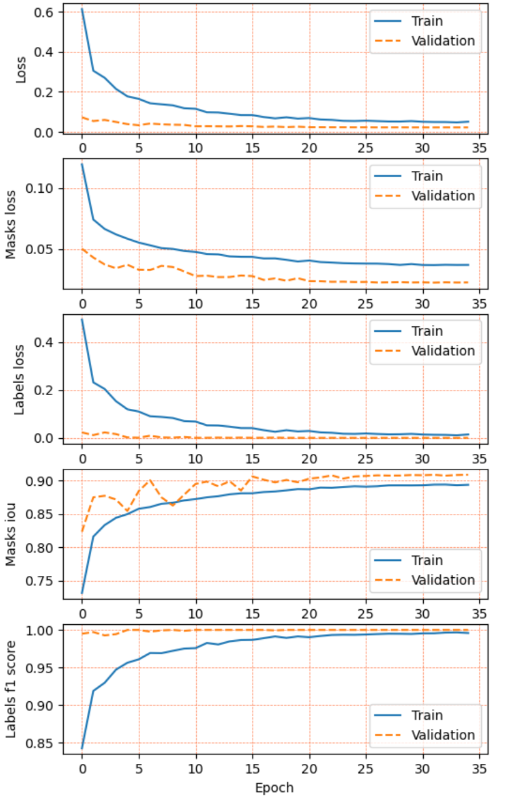

# Fish-Segmentation


This repository contains the implementation of the Segmentation and Classification road sign classifier. The German Traffic Sign Recognition Benchmark dataset (https://benchmark.ini.rub.de) was used for training and testing. It contains about 39000 training and 12500 test images belonging to 43 classes. The complexity of this dataset lies in the rather strong imbalance of the classes (see the figure below) so the class weights are applied during training.


Large Scale Fish Dataset has this configuration:
```
E:.
├───Black Sea Sprat
│   ├───Black Sea Sprat
│   └───Black Sea Sprat GT
├───Gilt-Head Bream
│   ├───Gilt-Head Bream
│   └───Gilt-Head Bream GT
├───Hourse Mackerel
│   ├───Hourse Mackerel
│   └───Hourse Mackerel GT
├───Red Mullet
│   ├───Red Mullet
│   └───Red Mullet GT
├───Red Sea Bream
│   ├───Red Sea Bream
│   └───Red Sea Bream GT
├───Sea Bass
│   ├───Sea Bass
│   └───Sea Bass GT
├───Shrimp
│   ├───Shrimp
│   └───Shrimp GT
├───Striped Red Mullet
│   ├───Striped Red Mullet
│   └───Striped Red Mullet GT
└───Trout
    ├───Trout
    └───Trout GT
```

When training a model, images for training are split into training and validation sets. Albumintations library (https://albumentations.ai/docs/api_reference/augmentations/) was used for image augmentation. As can be seen from the learning curves presented below, the classification quality metrics for the validation set were superior to those for the training set, which indicates that the model is not overfitting.



## Testing
This section presents the results of the trained model obtained on the test set: 

*Loss: 0.022;*

*Segmentation loss: 0.022;*

*Segmentation IoU: 91.2%;*

*Classification loss: 0.000;*

*Classification F1 score: 100%;*

Examples of image classification by model:


## Using script

If you want to train/evaluate or save the model by yourself, then use the code presented in **main.py**. The main parameters used in the code are specified in the file **config.py**. For image classification and segmentation by pretrained model use **test.py**. The trained model is stored in the folder **custom_DeeplabV3Plus (trained_model)**. Below are examples of image classification and segmentation by the trained model:


